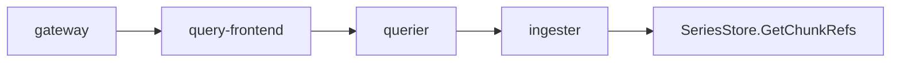
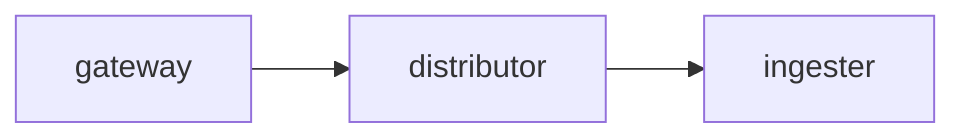

`Tempo`是Grafana Labs在`ObservabilityCON 2020`大会上新开源的一个用于做分布式式追踪的后端服务。它和Cortex、Loki一样，Tempo也是一个兼备`高扩展`和`低成本`效应的系统。

## 关于Tempo

Tempo本质上来说还是一个存储系统，它兼容一些开源的trace协议（包含Jaeger、Zipkin和OpenCensus等），将他们存在廉价的S3存储中，并利用TraceID与其他监控系统（比如Loki、Prometheus）进行协同工作。


可以看到Tempo的架构仍然分为`distributor`、`ingester`、`querier`、`tempo-query`、`compactor`这几个架构，熟悉Loki和Cortex的朋友可能光看名字就知道他们大概是做什么的。不熟悉的同学也没关系，下面简单说下各模块的作用：

- distributor

监听多个端口，分别接受来自Jaeger、Zipkin和OpenCensus协议的数据，按照TraceID进行哈希并映射到哈希环上，并交由ingester进行存储处理。当前distributor支持的trace协议如下：

| Protocol                | Port  |
| :---------------------- | :---- |
| OpenTelemetry           | 55680 |
| Jaeger - Thrift Compact | 6831  |
| Jaeger - Thrift Binary  | 6832  |
| Jaeger - Thrift HTTP    | 14268 |
| Jaeger - GRPC           | 14250 |
| Zipkin                  | 9411  |

- ingester

具体负责trace数据的块存储（memcache、GCS、S3）、缓存（Memcache）和索引的处理

- querier

负责从ingester和后端存储里面捞取trace数据，并提供api给查询者

- compactor

负责后端存储块的压缩，减少数据块数量

- tempo-query

tempo的一个可视化界面，用的`jaeger query`，可以在上面查询tempo的trace数据。

## Loki链路跟踪

> 要体验的同学，可以先下载在GitHub上的Docker-Compose，推荐配合本篇内容一起实践
> <https://github.com/CloudXiaobai/loki-cluster-deploy/tree/master/demo/docker-compose-with-tempo>

### Loki方面

在做之前我们先看下Loki的文档是怎么描述的:

*The tracing_config block configures tracing for Jaeger. Currently limited to disable auto-configuration per environment variables only.*

可以看到当前Loki对于Trace的支持集中在Jaeger，而且配置是默认开启的，并且只能在环境变量里面读取jaeger的信息。docker-compose下的案例如下：

```yaml
querier-frontend:
  image: grafana/loki:1.6.1
  runtime: runc
  scale: 2
  environment:
    - JAEGER_AGENT_HOST=tempo    \\tempo的地址
    - JAEGER_ENDPOINT=http://tempo:14268/api/traces
    - JAEGER_SAMPLER_TYPE=const   \\采样率类型
    - JAEGER_SAMPLER_PARAM=100    \\采样率100
```

### API网关方面

API网关并不是Loki的原生组件，而是在Loki分布式部署的情况下，需要有一个统一的入口对Loki API进行路由。之前用的Nginx，但是`原生的Nginx并不支持OpenTracing`。根据nginx1.14版本做了一个带jaeger模块的镜像用于Loki入口的trace生成和日志采集。

```yaml
gateway:
  image: quay.io/cloudxiaobai/nginx-jaeger:1.14.0
  runtime: runc
  restart: always
  ports:
    - 3100:3100
  volumes:
    - ./nginx.conf:/etc/nginx/nginx.conf
    - ./jaeger-config.json:/etc/jaeger-config.json
    - 'gateway_trace_log:/var/log/nginx/'
```

对于支持OpenTracing的Nginx，我们需要修改nginx.conf配置文件如下：

```json
...
#加载opentracing库
load_module modules/ngx_http_opentracing_module.so;
http {
 
  #启用opentracing
  opentracing on;
 
  #加载jaeger库
  opentracing_load_tracer /usr/local/lib/libjaegertracing_plugin.so /etc/jaeger-config.json;
 
  #日志格式，打印traceid
  log_format opentracing '"traceID":"$opentracing_context_uber_trace_id"';
 
  server {
    listen               3100 default_server;
    location = / {
      #向upstream转发时带上trace的头信息
      opentracing_operation_name $uri;
      opentracing_trace_locations off;
      opentracing_propagate_context;
      proxy_pass      http://querier:3100/ready;
    }
  }
}
```

> 以上只截取了Nginx部分配置，完整的要参考docker-compose里的nginx.conf

此外，nginx还需要一个jaeger-config.json，用于将trace数据转给agent处理。

```json
{
  "service_name": "gateway", \\服务名
  "diabled": false,
  "reporter": {
    "logSpans": true,
    "localAgentHostPort": "jaeger-agent:6831"  \\jaeger-agent地址
  },
  "sampler": {
    "type": "const",
    "param": "100"  \\采样率
  }
}
```

> 为了方便演示，配置的采样率均为100%

最后，我们为API网关启用一个Jaeger-agent用于收集trace信息并转给Tempo，它的配置如下：

```yaml
jaeger-agent:
  image: jaegertracing/jaeger-agent:1.20
  runtime: runc
  restart: always
  # 转发给tempo
  command: ["--reporter.grpc.host-port=tempo:14250"]
  ports:
    - "5775:5775/udp"
    - "6831:6831/udp"
    - "6832:6832/udp"
    - "5778:5778"
```

> 为什么API网关不直接发给Tempo要经过Jaeger-agent转发一下，认为用agent的方式更加灵活一些。

以上，我们就完成了Loki分布式追踪的配置部分，接下来我们用`docker-compose up -d`将服务都运行起来。

### Grafana方面

当docker的所有服务运行正常后，我们访问grafana并添加两个数据源

- 添加tempo数据源


- 添加Loki数据源，并解析API网关TraceID


> Loki提取TraceID的正则部分是从API网关的日志中匹配

## 体验Tempo

数据源设置OK后，我们进入Explore选择loki查询trace.log就可以得到API网关的日志了。

从Parsed Fields里面我们就可以看到，Grafana从API网关的日志里面提取了16位字符串作为TraceID了，而它关联了Tempo的数据源，我们点击`Tempo`按钮就可以直接切到Trace的信息如下：


展开Trace信息，我们可以看到Loki的一次查询的链路会经过下面几个部分



并且得出结论，本次查询的耗时主要落在Ingeter上，原因是查询的日志还没被flush到存储当中，querier需从ingester中取日志的数据。


我们再来看一个Loki接收日志的案例：


从trace的链路来看，当日志采集端往Loki Post日志时，请求的链路会经过如下部分：



同时，我们还看到了这次的提交的日志流经过两个ingester实例的处理，且处理时间没有明显差异。

## 总结

关于`Logging`和`Tracing`两部分在Grafana上的展示还没有达到ObservabilityCON 2020上的流畅度，不过根据会上的消息，更精细话的`trace <--> log`、`metrics <--> trace`和`metrics <--> log`这三部分互相协作部分应该很快会发布。届时Grafana将是云上可观测性应用系统里的王者级产品（虽然有额外的各种查询语句学习成本）
