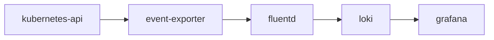

在Kubernetes API的众多对象中，Events算是最容易被我们忽视的类型之一。与其他对象相比，Event的活动量很大，不太可能长时间存储在etcd中，默认情况下，Event留存时间也只有1小时。当我们使用`kubectl describe`获取一个对象时，可能因时间超限而无法获取它的历史事件，这对集群的使用者非常的不友好。除了能查看集群事件外，我们可能还有类似追踪一些特定的Warning事件（如Pod生命周期、副本集或worker节点状态）来进行相关告警的需求。那么在开启本期话题之前，我们先来理解下Kubernetes Events的结构，下述是官访问给出的几个重要字段解释

- **Message**: A human-readable description of the status of this operation
- **Involved Object**: The object that the event is about, like Pod, Deployment, Node, etc.
- **Reason: Short**, machine-understandable string – in other words, Enum
- **Source**: The component reporting this event; a short, machine-understandable string, i.e., kube-scheduler
- **Type**: Currently holds only Normal & Warning, but custom types can be given if desired.
- **Count**: The number of times the event has occurred

对于这些事件，我们期望能有一个采集工具将信息输出到一个持久化的地方进行存储和分析。在以往，通常我们将kubernetes的事件输出到Elasticsearch进行索引分析。

既然本文讨论的是以Loki来分析kubernes的事件，那我们对于事件的处理基本按照如下流程：



目前能够采集Kubernetes Events的开源组件主要以阿里云开源的kube-eventer和Opsgenie开源的kubernetes-event-exporter为主（kubesphere也有一个kube-events，不过需要配合其它组件的CRD使用，所以不在讨论范围之中）

当事件进入到Loki后，就可以通过LogQL v2语句在Grafana上进行可视化查询，比如我们可以让Kubernetes中的事件按照等级、类型分类统计展示。通过Dashboard可以快速看到集群当前的的一些异常情况。

## kubernetes-event-exporter

首先需要部署kubernetes-event-exporter，它会将集群的事件打印到`容器stdout当中`以方便日志采集

```yaml
apiVersion: v1
kind: ServiceAccount
metadata:
  name: event-exporter
  namespace: kube-system
---
apiVersion: rbac.authorization.k8s.io/v1
kind: ClusterRoleBinding
metadata:
  name: event-exporter
roleRef:
  apiGroup: rbac.authorization.k8s.io
  kind: ClusterRole
  name: view
subjects:
  - kind: ServiceAccount
    namespace: kube-system
    name: event-exporter
---
apiVersion: v1
kind: ConfigMap
metadata:
  name: event-exporter-cfg
  namespace: kube-system
data:
  config.yaml: |
    logLevel: error
    logFormat: json
    route:
      routes:
        - match:
            - receiver: "dump"
    receivers:
      - name: "dump"
        file:
          path: "/dev/stdout"
---
apiVersion: apps/v1
kind: Deployment
metadata:
  name: event-exporter
  namespace: kube-system
spec:
  replicas: 1
  template:
    metadata:
      labels:
        app: event-exporter
        version: v1
    spec:
      serviceAccountName: event-exporter
      containers:
        - name: event-exporter
          image: opsgenie/kubernetes-event-exporter:0.9
          imagePullPolicy: IfNotPresent
          args:
            - -conf=/data/config.yaml
          volumeMounts:
            - mountPath: /data
              name: cfg
      volumes:
        - name: cfg
          configMap:
            name: event-exporter-cfg
  selector:
    matchLabels:
      app: event-exporter
      version: v1
```

当容器完全运行之后，通过kubectl logs可以看到event-exporter容器会以json格式打印的集群事件了。


通常运行在Kubernetes之上Fluentd和FluentBit默认会采集容器的日志，我们需要做的是将这些内容发送给Loki

这里就不对日志采集的配置做其他说明，有疑问的同学可以参考之前的文章《fluentd和loki的那些事儿》

最终我们可以在Dagger上查询Kubernetes事件的写入情况


## 扩展 Node Problem Detector

Kubernetes中关于Node的事件不多，对于节点上更多偏向底层的状态（如内核死锁、容器运行时无响应等）并不能通过事件的方式通知出来。**Node Problem Detector**作为一个很好的补充，它可以将node上更细节的事件以`NodeCondition`和`Event`方式上报给Kubernetes。

安装**Node Problem Detector**非常简单，只需要通过helm的两条命令即可完成。

```bash
helm repo add deliveryhero https://charts.deliveryhero.io/
helm install deliveryhero/node-problem-detector
```

**Node Problem Detector**支持用户运行自定义脚本来构造事件，本文中的Node Problem Detector除了默认的配置外，还有关于定义的网络监控脚步来做node节点上Conntrack的检查

```yaml
apiVersion: v1
kind: ConfigMap
metadata:
  name: node-problem-detector-config
  namespace: kube-system
data:
  network_problem.sh: |
    #!/bin/bash
    readonly OK=0
    readonly NONOK=1
    readonly UNKNOWN=2

    readonly NF_CT_COUNT_PATH='/proc/sys/net/netfilter/nf_conntrack_count'
    readonly NF_CT_MAX_PATH='/proc/sys/net/netfilter/nf_conntrack_max'
    readonly IP_CT_COUNT_PATH='/proc/sys/net/ipv4/netfilter/ip_conntrack_count'
    readonly IP_CT_MAX_PATH='/proc/sys/net/ipv4/netfilter/ip_conntrack_max'

    if [[ -f $NF_CT_COUNT_PATH ]] && [[ -f $NF_CT_MAX_PATH ]]; then
      readonly CT_COUNT_PATH=$NF_CT_COUNT_PATH
      readonly CT_MAX_PATH=$NF_CT_MAX_PATH
    elif [[ -f $IP_CT_COUNT_PATH ]] && [[ -f $IP_CT_MAX_PATH ]]; then
      readonly CT_COUNT_PATH=$IP_CT_COUNT_PATH
      readonly CT_MAX_PATH=$IP_CT_MAX_PATH
    else
      exit $UNKNOWN
    fi

    readonly conntrack_count=$(< $CT_COUNT_PATH) || exit $UNKNOWN
    readonly conntrack_max=$(< $CT_MAX_PATH) || exit $UNKNOWN
    readonly conntrack_usage_msg="${conntrack_count} out of ${conntrack_max}"

    if (( conntrack_count > conntrack_max * 9 /10 )); then
      echo "Conntrack table usage over 90%: ${conntrack_usage_msg}"
      exit $NONOK
    else
      echo "Conntrack table usage: ${conntrack_usage_msg}"
      exit $OK
    fi
  network-problem-monitor.json: |
    {
        "plugin": "custom",
        "pluginConfig": {
            "invoke_interval": "30s",
            "timeout": "5s",
            "max_output_length": 80,
            "concurrency": 3
        },
        "source": "network-plugin-monitor",
        "metricsReporting": true,
        "conditions": [],
        "rules": [
            {
                "type": "temporary",
                "reason": "ConntrackFull",
                "path": "/config/network_problem.sh",
                "timeout": "5s"
            }
        ]
    }
...
```

再编辑node-problem-detector的daemonset文件，将如下的自定义的脚本和规则内容引入

```yaml
...
      containers:
      - name: node-problem-detector
        command:
        - /node-problem-detector
        - --logtostderr
        - --config.system-log-monitor=/config/kernel-monitor.json,/config/docker-monitor.json
        - --config.custom-plugin-monitor=/config/network-problem-monitor.json
        - --prometheus-address=0.0.0.0
        - --prometheus-port=20258
        - --k8s-exporter-heartbeat-period=5m0s
...
      volumes:
      - name: config
        configMap:
          defaultMode: 0777
          name: node-problem-detector-config
          items:
          - key: kernel-monitor.json
            path: kernel-monitor.json
          - key: docker-monitor.json
            path: docker-monitor.json
          - key: network-problem-monitor.json
            path: network-problem-monitor.json
          - key: network_problem.sh
            path: network_problem.sh
```

## Grafana分析面板

已经将基于Loki的Kubernetes事件分析面板贡献在了Grafana Lab上面，我们可以访问如下网站下载Dashboard

<https://grafana.com/grafana/dashboards/14003>

当将面板导入到Grafana之后，我们需要修改Panel的log查询语句，将{job="kubernetes-event-exporter"}替换为自己exporter的标签。


之后，我们就可以得到如下的分析面板


